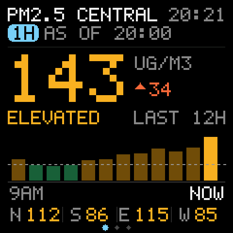
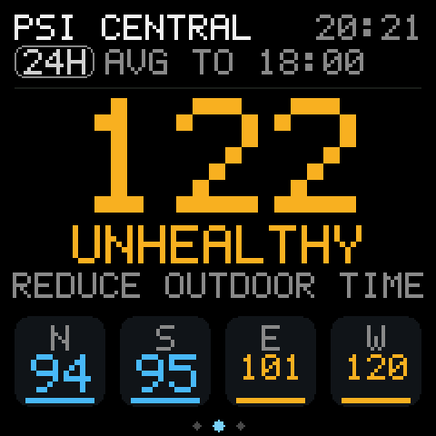
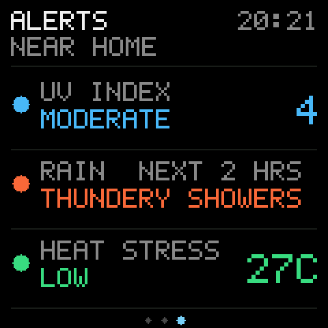
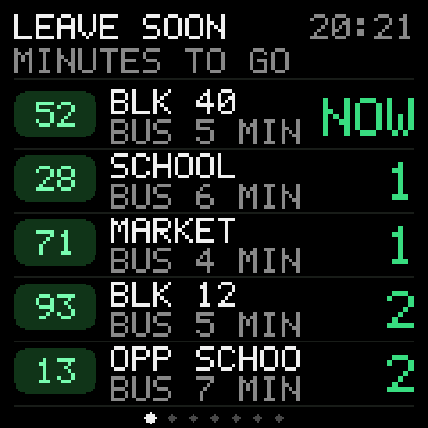
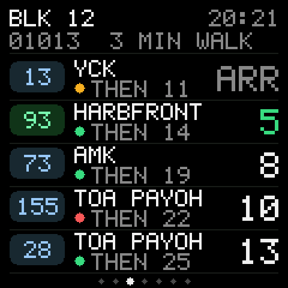
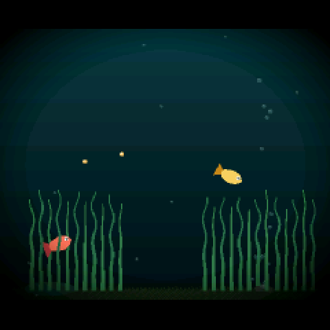

# Pocket Tank, one-button edition 🐟🚌🌫️

A pocket-sized ESP32 gadget that does three things on a single button:

- **AIR**: Singapore's air right now (1-hour PM2.5 with a 12-hour chart), today's 24-hour PSI, and alerts for UV, rain and heat stress near you.
- **BUS**: live arrival times for the bus stops around your home, with a LEAVE SOON page that already subtracts your walk to each stop.
- **FISH**: the [Pocket Tank](https://github.com/mediacutlet/pocket-tank) AI fish tank by MediaCutlet, unchanged.

This is a port of [mediacutlet/pocket-tank](https://github.com/mediacutlet/pocket-tank) (MIT) to the **Spotpear ESP32-S3 1.54" "muma" board**, a cheap board sold for the XiaoZhi chatbot, with no touch screen and one button. All credit for the fish goes to the original project.

| 1H PM2.5 (start-up) | 24H PSI | Alerts |
|:---:|:---:|:---:|
|  |  |  |
| **LEAVE SOON** | **One stop per page** | **FISH** (by MediaCutlet) |
|  |  |  |

*Screens rendered by the board's own drawing code, with example stops.*

## Install from your browser

The quickest way: open **https://iamjacksonlow.github.io/pocket-tank-esp32/** in Chrome or Edge, plug in the board and click Install. No tools needed. That ready-made build shows two example bus stops in the city; to show the stops around your home, follow **Set it up** below and build it yourself.

## What you need

- **The board:** Spotpear "ESP32-S3 AI DeepSeek XiaoZhi DouBao 1.54 inch LCD" (ESP32-S3 N16R8: 16 MB flash, 8 MB PSRAM; ST7789 240×240 LCD; ES8311 audio; one BOOT button; battery). Other ESP32-S3 boards with 16 MB flash and PSRAM can work, but the screen and pin setup in `display_port_st7789.c` is for this one.
- **A USB-C cable**, and Chrome or Edge on a computer.
- **To build it yourself:** [ESP-IDF v5.4](https://docs.espressif.com/projects/esp-idf/en/v5.4/esp32s3/get-started/).
- AIR and BUS use **Singapore** open data (LTA and data.gov.sg). The fish work anywhere, even with no Wi-Fi.

## The button

| | AIR | BUS | FISH |
|---|---|---|---|
| **1 press** | Next page | Next stop | Drop food |
| **2 presses** | Refresh, back to 1H | Refresh, back to LEAVE SOON | Lights on / off |
| **3 presses** | → BUS | → FISH | → AIR |
| **Hold 2 s** | Sleep (saves first). Press to wake. | | |

With no presses, pages move on every 2 minutes. A short AIR / BUS / FISH label pops up whenever the mode changes.

## Set it up

**1. Your stops and area.** Copy the example settings and edit them:

```bash
cd firmware/main
cp user_config.example.h user_config.h
```

In `user_config.h` set:

- **Your bus stops.** Use the 5-digit code printed on the stop's pole (or shown in any SG bus app), a short name, the road, and how many minutes it takes you to walk there.
- **Your 2-hour forecast area.** Use the name exactly as data.gov.sg spells it, for example `"Tampines"`.
- **The nearest heat-stress station.**
- **A label for the alerts page.**

`user_config.h` is git-ignored, so your home stops never get committed.

**2. (Optional) An LTA DataMall key.** [Request one here](https://datamall.lta.gov.sg/content/datamall/en/request-for-api.html) (free). There are two ways to use it:

- Put it in `USER_LTA_KEY`.
- Type it on the Wi-Fi setup page later. It's then saved on the board, not in code.

Without a key, BUS uses the free [arrivelah](https://github.com/cheeaun/arrivelah) API, which serves the same LTA data.

**3. Build:**

```bash
. ~/esp/esp-idf/export.sh
cd firmware
idf.py build
```

**4. Flash.** With ESP-IDF:

```bash
idf.py -p PORT flash
python -m esptool --chip esp32s3 -p PORT write_flash 0x310000 ../model/out/model_q4.bin   # the fish brain, once
```

Or from the browser, with [Espressif's web flasher](https://espressif.github.io/esptool-js/): click Connect, pick the board's port, then add these four files at these addresses and press Program. **Leave Flash Mode on "keep".**

| Address | File |
|---|---|
| `0x0` | `firmware/build/bootloader/bootloader.bin` |
| `0x8000` | `firmware/build/partition_table/partition-table.bin` |
| `0x10000` | `firmware/build/pocket_tank.bin` |
| `0x310000` | `model/out/model_q4.bin` (only needed once) |

To update later, flash `pocket_tank.bin` at `0x10000` on its own. Your fish, and your Wi-Fi settings, live in NVS and survive updates.

**5. Wi-Fi.** On first start the board opens a hotspot called **PocketTank-Setup**:

1. Join it from your phone.
2. Pick your home Wi-Fi (and paste an LTA key if you have one).
3. Done.

Your password is only ever typed on that page and is stored on the board.

## Where the data comes from

| Screen | Source | How often |
|---|---|---|
| 1H PM2.5, 5 regions, last 12 hours | data.gov.sg `pm25` | hourly |
| 24H PSI, 5 regions | data.gov.sg `psi` | hourly |
| UV index | data.gov.sg `uv` | hourly |
| Rain, next 2 hours | data.gov.sg `two-hr-forecast` | every 30 min |
| Heat stress (WBGT) | data.gov.sg `weather?api=wbgt` | every 15 min |
| Bus arrivals | LTA DataMall `v3/BusArrival`, or arrivelah | every 20 s while BUS is open |

NEA doesn't publish a 1-hour PSI. Its hourly figure is the 1-hour PM2.5 concentration (µg/m³), which has its own bands. That's why the 1H and 24H pages look deliberately different.

**Battery:** in AIR, Wi-Fi switches on only for a few seconds every 10 minutes. BUS keeps it on while open. FISH turns it off.

## What changed from upstream

These are all in `firmware/`:

- **`main/display_port_st7789.c`**: the 240×240 ST7789 panel and backlight. The tank is scaled to fit.
- **`main/bus.c`**: Wi-Fi, the setup hotspot, LTA and arrivelah bus fetching, data.gov.sg air fetching, and the BUS and AIR paging.
- **`main/air_ui.c` and `main/ui240.c`**: the AIR pages and shared 240-pixel drawing helpers.
- **`main/battery_port_adc.c`**: the battery gauge.
- **`main/main.c`**: the one-button mode machine (AIR → BUS → FISH).
- **`partitions_muma.csv`**: the 16 MB layout, with the app at `0x10000` and the fish model at `0x310000`.
- **Saving:** the tank saves every minute and on each press, so pulling the power loses at most a minute.
- **Voice:** offline voice commands (esp-sr) are included but **off**, because they never recognised speech reliably on this board's microphone. See `firmware/sdkconfig.voice` if you want to experiment.

The original Waveshare AMOLED build settings are kept in `firmware/sdkconfig.defaults.waveshare`.

## Credits

- **The fish:** [Pocket Tank](https://github.com/mediacutlet/pocket-tank) by MediaCutlet (MIT). The fish, the model and the tank are all theirs.
- **Bus data:** [LTA DataMall](https://datamall.lta.gov.sg) and [arrivelah](https://github.com/cheeaun/arrivelah).
- **Air and weather data:** [data.gov.sg](https://data.gov.sg) (NEA).

MIT licensed, like the original.

---

## About the fish

The fish tank is entirely the work of **MediaCutlet**. For how the fish think, the model, the training pipeline, the simulator and everything else about the tank, see the original project: **[mediacutlet/pocket-tank](https://github.com/mediacutlet/pocket-tank)**. This repo only adds the one-button board port, AIR and BUS on top. The upstream code and docs are kept here unchanged under the MIT license.
